## Objetivo del proyecto
Desarrollar un programa en C, ejecutado en una máquina virtual Ubuntu, que procese en paralelo un conjunto de transacciones simuladas.
Medir y analizar los tiempos de ejecución del procesamiento en paralelo.

## Descripción del proyecto
El proyecto consiste en el desarrollo de un sistema de software en lenguaje C ejecutado sobre una distribución Ubuntu Linux, diseñado para simular el procesamiento masivo, paralelo y en tiempo real de transacciones de streaming.

A través de la división del trabajo en múltiples hilos, el sistema asume el rol de un motor de preprocesamiento de datos que limpia anomalías numéricas, imputa valores ausentes mediante estadística descriptiva y normaliza los registros de forma simultánea directamente en la memoria RAM.

El programa se estructura en torno a un búfer circular que actúa como un espacio de almacenamiento temporal para las transacciones entrantes, permitiendo que los hilos de procesamiento accedan y modifiquen los datos de manera eficiente y coordinada.

## Explicacion del código

### Implementación de bibliotecas y variables globales

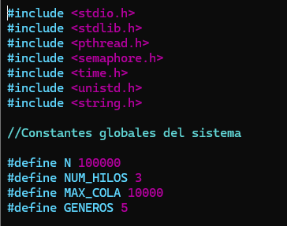{fig-align="center" width="450px"}

_Figura 1: Bibliotecas y variables globales_

- Bibliotecas: _<pthread.h>_ proporciona la API para la creación y gestión de hilos. _<semaphore.h>_ provee los semáforos contadores necesarios para la sincronización._<time.h>_ se usa mediante clock_gettime para obtener marcas de tiempo con precisión de nanosegundos.
- Variables globales: Definen el tamaño del problema (100,000 registros), el grado de paralelismo (3 hilos de procesamiento) y el límite del búfer circular compartido (10,000 espacios), optimizando el uso de la memoria RAM sin sobrecargar el sistema.

### Definición de Tipos y Estructuras de Datos

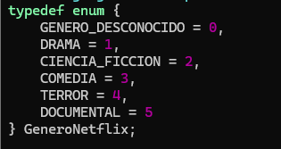{fig-align="center" width="450px"}

_Figura 2: Enumerador para tipos de géneros de películas_

_GeneroNetflix_ funciona como un enumerador que mapea los géneros de películas a valores enteros. El 0 representa explícitamente un dato ausente o corrupto que requerirá imputación.

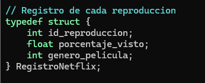{fig-align="center" width="450px"}

_Figura 3: Definición de la estructura del dataset_

_RegistroNetflix_ se encarga de definir la estructura base del dataset. Almacena el estado original e intermedio de cada reproducción.

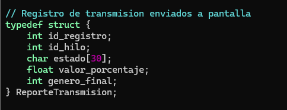{fig-align="center" width="450px"}

_Figura 4: Definición de la estructura del reporte de transmisión_

_ReporteTransmision_ es la estructura del elemento que viajará por el pipeline a través de la cola circular. Contiene campos de auditoría como qué hilo lo procesó (_id_hilo_) y una cadena de texto descriptiva (_estado_) que el hilo de monitoreo evaluará para bifurcar la salida en consola.

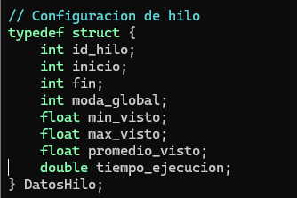{fig-align="center" width="450px"}

_Figura 5: Definición de la estructura de datos por hilo_

_DatosHilo_ funciona como una estructura de configuración técnica. Le indica el rango de índices sobre el que tiene soberanía (_inicio_ y _fin_) a cada hilo y proporciona los estadísticos globales para que se realice el procesamiento de forma independiente sin generar colisiones en la lectura de métricas.

### Estado Global y Recursos del Sistema Operativo

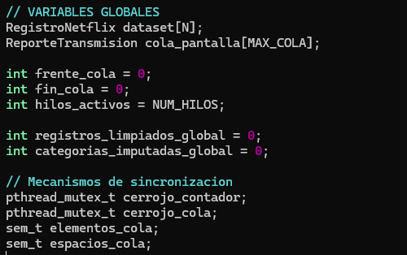{fig-align="center" width="450px"}

_Figura 6: Estado Global y Recursos del Sistema Operativo_

- Estructuras en RAM:_dataset_ aloja los 100,000 registros iniciales, mientras que  __cola_pantalla__ actúa como la estructura intermedia compartida (Buffer Circular).

- Apuntadores de la Cola: __frente_cola__ (dónde lee el monitor) y __fin_cola__ (dónde escriben los hilos trabajadores).

- Mecanismos de sincronización: __cerrojo_cola__ es un mutex que garantiza que sólo un hilo a la vez modifique los índices de la cola. __cerrojo_contador__ es un mutex encargado de proteger la sección crítica donde se acumulan los contadores globales finales. __espacios_cola__ y __elementos_cola__ son semáforos que coordinan el flujo del patrón asegurando que los hilos trabajadores no escriban en la cola cuando está llena y que el hilo monitor no lea cuando está vacía.

### Generacion del dataset y estadísticas.

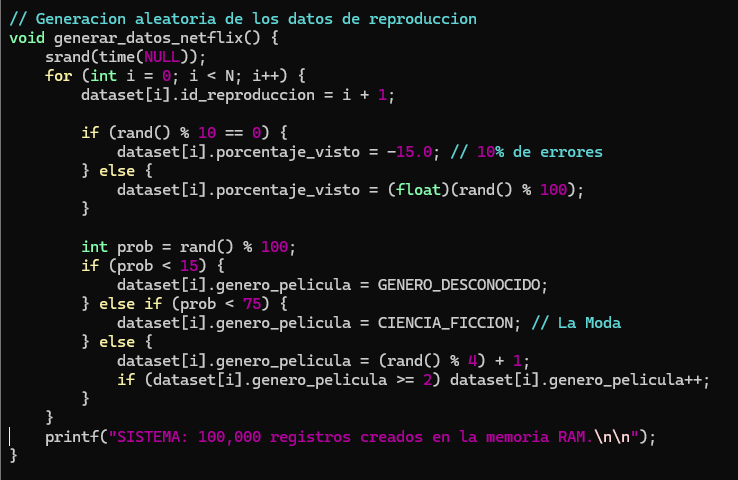{fig-align="center" width="750px"}

_Figura 7: Generación de datos_

Se generan datos controlados en memoria. Se fuerza un 10\% de valores anómalos (porcentaje negativo de -15.0) y un 15\% de géneros desconocidos. Además se estructura a __CIENCIA_FICCION__ como la moda estadística del lote para verificar posteriormente la efectividad de los procesos de limpieza e imputación.

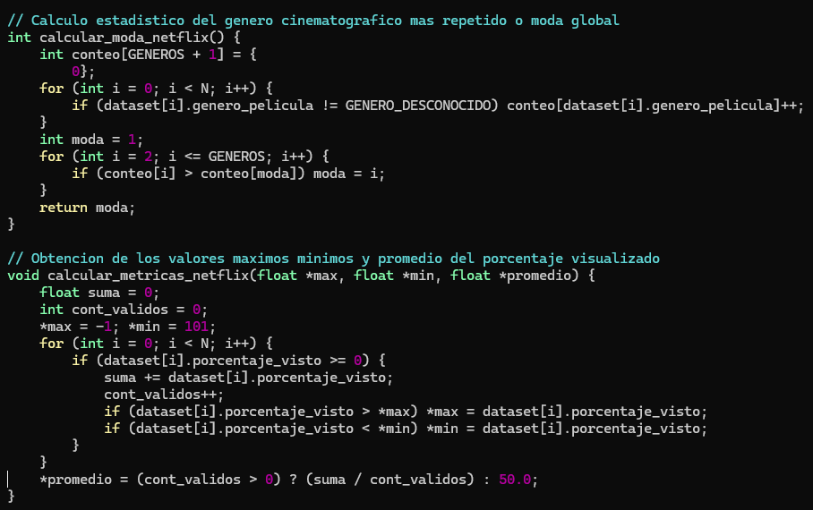{fig-align="center" width="850px"}

_Figura 8: Calculo de métricas base_

__calcular_moda_netflix__ funciona como un algoritmo de frecuencias que cuenta la incidencia de cada categoría válida utilizando un arreglo indexado por el valor del enumerador. Devuelve el identificador numérico de la categoría dominante.
__calcular_metricas_netflix__ calcula el máximo, mínimo y promedio algebraico recorriendo la memoria de manera secuencial, ignorando los valores negativos para evitar sesgos en el cálculo del promedio de visualización real. 

### Procesamiento Secuencial

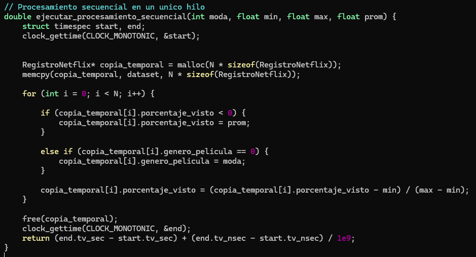{fig-align="center" width="850px"}

_Figura 9: Procesamiento Secuencial_

Se reserva memoria dinámica (_malloc_) y clona el arreglo original (_memcpy_). Esto se hace para procesar secuencialmente todo el volumen de datos en un solo hilo físico sin alterar los datos corruptos originales, permitiendo comparar el rendimiento del monoprocesamiento frente al procesamiento multitarea de los hilos.

### Procesamiento enparalelo

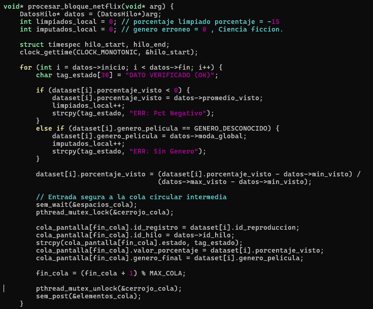{fig-align="center" width="850px"}

_Figura 10: Procesamiento enparalelo con hilos trabajadores_

- Paralelismo de Datos: Cada hilo procesa de forma independiente su propia sección del arreglo global gracias a los límites antes establecidos establecidos  _datos->inicio_ y _datos->fin_, eliminando conflictos de lectura/escritura en el dataset base.

- Al colocar un reporte en el búfer compartido, el hilo debe restar un espacio libre mediante __sem_wait(&espacios_cola)__ y asegurar el índice usando __pthread_mutex_lock(&cerrojo_cola)__. Tras registrar el elemento y mover el puntero de forma circular libera el control y se aumenta  el contador de elementos disponibles con __sem_post(&elementos_cola).__

- Antes de finalizar el hilo __pthread_exit__, se emplea el mutex __cerrojo_contador__ para actualizar las variables globales de reporte estadístico acumulado sin corromper la memoria del proceso padre.

### Cronometraje de la ejecución

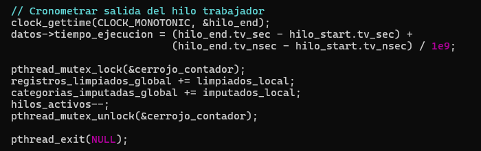{fig-align="center" width="750px"}

_Figura 11: Cronometraje de salida del hilo_

Se utiliza __clock_gettime__ con la constante  __CLOCK_MONOTONIC__ para obtener marcas de tiempo antes y después del procesamiento secuencial y paralelo. Además se usan mutex para proteger la sección crítica donde se acumulan los tiempos totales de cada hilo, permitiendo un análisis posterior del rendimiento entre ambos enfoques.

### Hilo de monitoreo dinámico

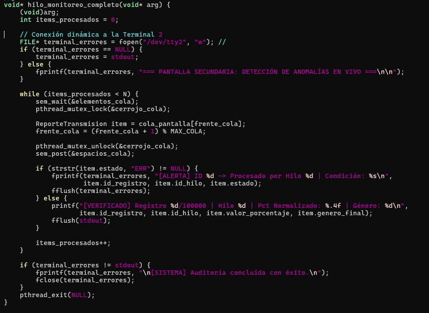{fig-align="center" width="850px"}

_Figura 12: Hilo de monitoreo_

- Búfer de Salida Directo: Se utiliza _fflush()_ después de cada escritura. Por defecto, _stdout_ retiene los caracteres en memoria para optimizar la salida; forzar el vaciado asegura una visualización fluida y en tiempo real en la pantalla.

- Interacción con el Sistema de Archivos de Unix (/dev/tty2): Se intenta abrir el dispositivo de caracteres asociado a la segunda terminal del sistema. Si el script se ejecuta con los privilegios necesarios en un entorno Linux, las alertas de error se enviarán directamente a otra consola, logrando separar visualmente los registros limpios de las anomalías de manera física.

### Main

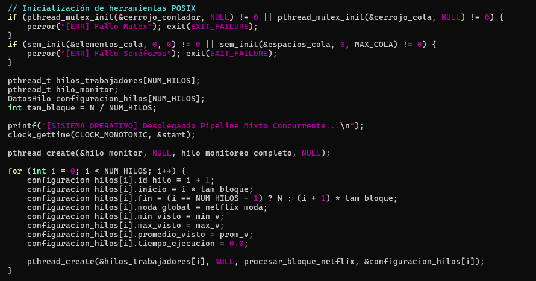{fig-align="center" width="850px"}

_Figura 13: Inicialización POSIX, despliegue de hilos y division de trabajo_

- Se asignan los recursos del kernel para estructurar el correcto funcionamiento de los semáforos y los mutex.

- Cálculo de Rangos: Divide el tamaño del lote N de manera equitativa. El último hilo toma cualquier residuo de división para que ningún registro quede sin procesar.

- __pthread_create__ permite instanciar el hilo de monitoreo y los tres hilos trabajadores, pasando las configuraciones específicas a través de punteros de tipo _void*_.

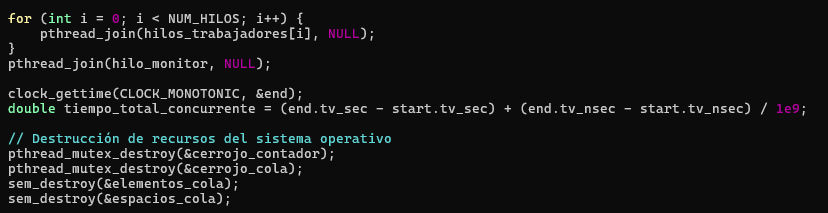{fig-align="center" width="850px"}

_Figura 14: Sincronización y destrucción de recursos_

-  __pthread_join__ suspende la ejecución del hilo principal (main) hasta que los hilos trabajadores completen su rango asignado y el hilo de monitoreo consuma el último de los 100,000 elementos.
- Una vez cerrado el pipeline de concurrencia, se liberan los semáforos y mutexes para devolver el control al sistema operativo y evitar fugas de recursos.

### Análisis de eficiencia del Sistema

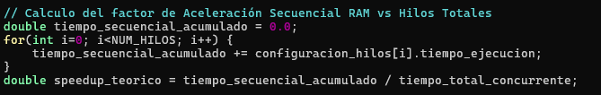{fig-align="center" width="650px"}

_Figura 15:  Calculo del factor de Aceleración Secuencial RAM vs Hilos Totales_

- Evaluación Métrica: Suma el tiempo de ejecución individual de cada hilo para calcular el __tiempo_secuencial_acumulado__ y lo compara frente al __tiempo_total_concurrente__.

- Al ejecutar el código el __speedup_teorico__ puede ser inferior a 1.0x. Esto ocurre porque la impresión en consola (printf) a través de llamadas de sistema, es una operación de Entrada/Salida muy lenta en comparación con el procesamiento directo en la memoria RAM. El programa expone de forma didáctica cómo la sincronización y la visualización de datos en consola añaden una sobrecarga (overhead) que impacta directamente en el rendimiento de los hilos de ejecución.

## Ejecución del programa
Antes de la ejecución es importante tener encuenta los siguientes comandos para compilar y ejecutar el programa en la terminal de Linux:

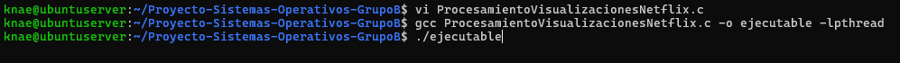{fig-align="center" width="950px"}

_Figura 16: Comandos para compilar y ejecutar el programa_

En la salida del programa se puede observar el tiempo de ejecución de cada hilo, el tiempo secuencial puro y acumulado, el tiempo concurrente real y eficiencia del pipeline. Además, se muestra en la consola los registros limpios y las anomalías detectadas.

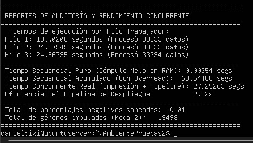{fig-align="center" width="550px"}

_Figura 17: Salida del programa_

## Gráficas de análisis de tiempos

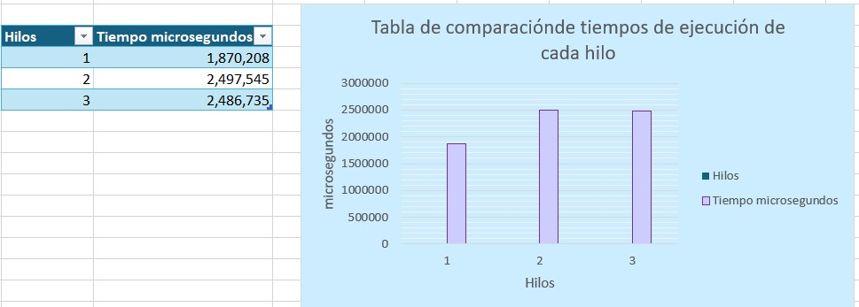{fig-align="center" width="750px"}

_Figura 18: Comparación de los tiempos que se tarda cada hilo ejecutando todas sus tareas_

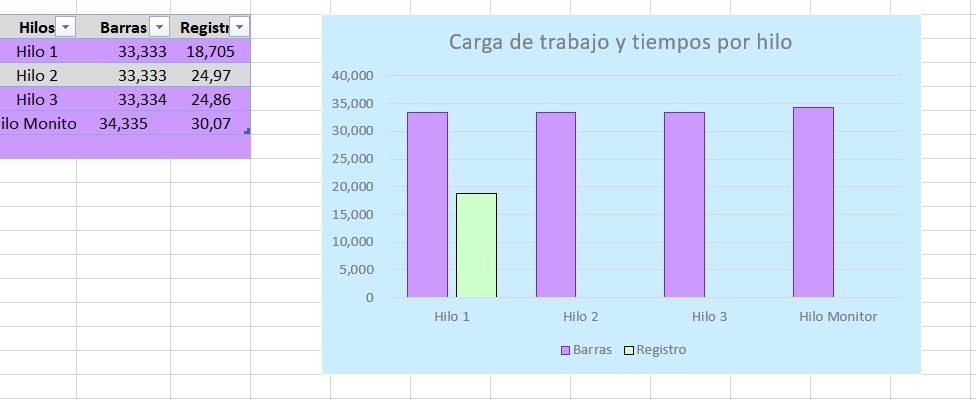{fig-align="center" width="750px"}

_Figura 19:  Comparativa de la carga de trabajo según el hilo_

## Conclusiones del proyecto 
1. Al realizar el programa el procesar, cada hilo individualmente, genera desgaste de memoria y de recursos, por esa razón se aplica el uso de multihilos, para que el programa sea escalable, flexible y optimice los recursos que ocupa del procesador, separándose en 100 partes semejantes, los hilos que trabajan en procesamiento, limpieza y normalización son 3 hilos que trabajan al mismo tiempo , para que el Sistema Operativo en este caso Linux regule las tareas y las reparta de manera eficiente entre los núcleos del CPU. 

2. Las funciones de entrada y salida, son manejadas por medio del hilo de monitoreo, que sus cambios afectan al Kernel gracias al direccionamiento a una segunda terminal, porque el tamaño de la cola es limitado, (100000),  aplicando de manera necesaria el uso de mutex y de semáforos, ya que el hilo monitor asigna un tiempo aproximado de 10 milisegundos a cada sección de registros, llenando la cola con 10 ciclos que solo al terminar todo puede avanzar con los siguientes procesos. 
3. La implementación de semáforos sirve para proteger la región critica que tenemos en la cola circular, procurando que los hilos no se ejecuten de manera asincrónica, al memento de verificar el tiempo en que los hilos se demoran en ejecutarse, el hilo 1 es el que se demora menos que el hilo 2 y 3, porque el planificador de Linux y la administración de la cola que comparten entre hilos, implementan su comportamiento dinámico característico,  dando al hilo 1 el menor grado de contención al inicial el proceso de los datos del registro de películas en Netflix.

## Referecias Bibliográficas
### Bibliografía
Bansal, S. (2021). Netflix Movies and TV Shows. Kaggle.com. https://www.kaggle.com/datasets/shivamb/netflix-showsMartinez, S. (2026a). 

Clase4 -Capítulo 2: Gestión de Procesos. Epn.edu.ec. https://aulasvirtuales.epn.edu.ec/pluginfile.php/16626266/mod_resource/content/1/Clase%204.pdf, S. (2026b). 

Clase5 -Capítulo 2: Gestión de Procesos. Epn.edu.ec. https://aulasvirtuales.epn.edu.ec/pluginfile.php/16645956/mod_resource/content/1/Clase%205.pdf

pthreads(7) - Linux manual page. (2026). Man7.org. https://man7.org/linux/man-pages/man7/pthreads.7.html

### Uso de IA 

_Porcentaje de uso_: 15%
_Motivo:_ Ayuda con la busqueda de tipos de datos y funciones propias de C que sean adecuados para el proposito del programa como: typedef enum, typedef estruc, FILE* , memcpy(), malloc(). La aplicacion de inteligencia artificial fue con proposito de agilizar investigaciones sobre C.
